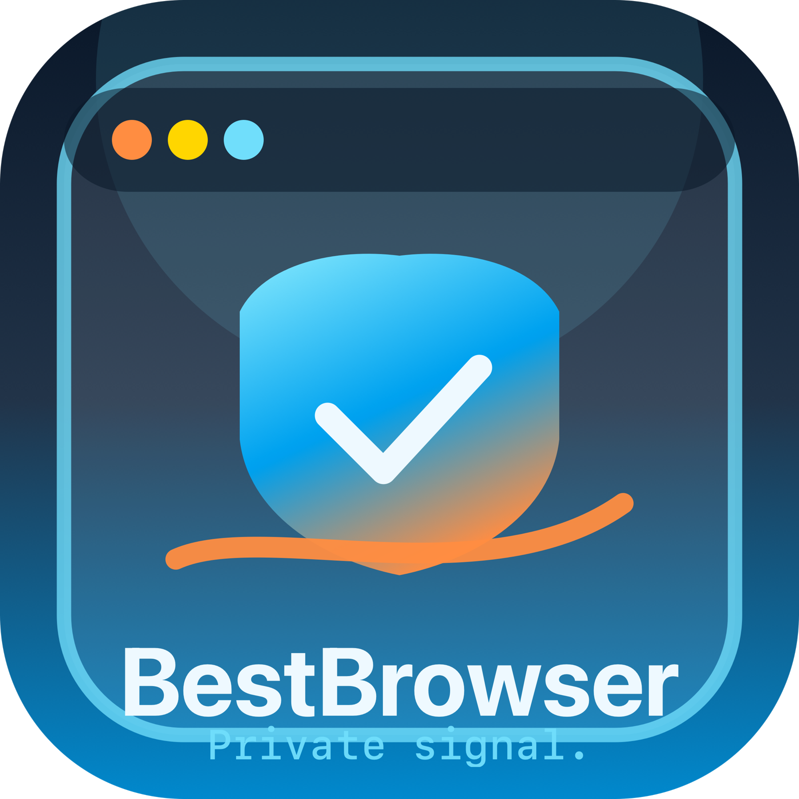
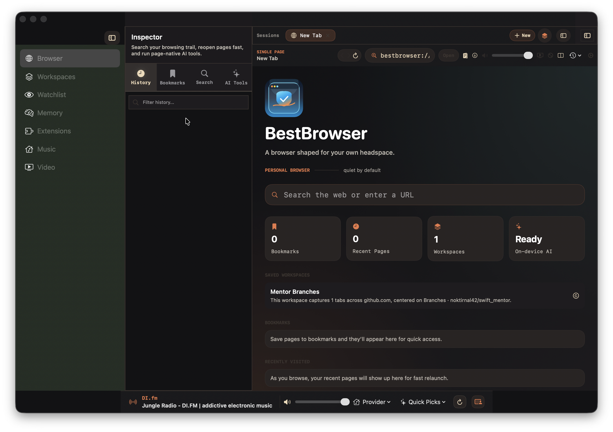
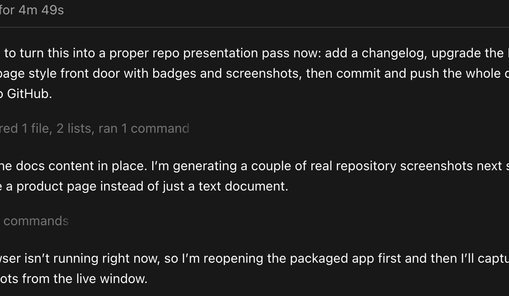

# BestBrowser



[](VERSION)
[](docs/DEVELOPMENT.md)
[](Package.swift)
[](V3_PLAN.md)

**Quiet focus. Your web.**

BestBrowser is a native macOS browser workspace built with SwiftUI and WebKit for people who keep research, saved sessions, ambient music, background video, and page-native tools open at the same time. It is designed to feel more like a focused desktop workspace than a generic browser with an AI tab glued on later.

## Why BestBrowser

- Native macOS browser shell in SwiftUI and WebKit
- Workspaces, session restore, tab groups, and split browsing
- On-device AI features powered by Apple Foundation Models
- Watchlist and memory surfaces for longer-running research
- Built-in music and video companion panes
- Privacy tooling for ad blocking, tracker blocking, and page cleanup
- In-app extension system for browser-native actions and page tools

## Product Screens

### Browser Workspace



### Media Companion Experience



## Core Surfaces

BestBrowser currently ships around seven main surfaces:

- `Browser`: tabbed browsing, split view, inspector, page tools
- `Workspaces`: saved sessions and grouped browser context
- `Watchlist`: change monitoring for important pages
- `Memory`: recalled page context and captured browsing history
- `Extensions`: bundled and user-provided browser-native tools
- `Music`: DI.fm, Spotify, and Apple Music companion surface
- `Video`: YouTube, Twitch, Prime Video, and Max companion surface

## What Makes It Different

### Research First

BestBrowser is strongest when you are keeping multiple kinds of context alive:

- a working set of tabs
- saved workspace groupings
- watched pages
- AI summaries and compare flows
- a background media stream

### Media Built In

Instead of forcing everything into standard tabs, BestBrowser has dedicated media surfaces and mini players so music and video can stay nearby without taking over your main browsing flow.

### Native macOS Feel

The app is built around:

- SwiftUI
- WebKit
- keyboard-driven commands
- sidebar routing
- window-aware UI
- compact desktop-style controls

## Feature Snapshot

### Browser UX

- Session restore and reopen closed tabs
- Split browsing with pane-aware navigation
- Vertical tabs and tab grouping
- Command palette and keyboard shortcuts
- Reading mode and page cleanup actions

### AI and Context

- On-device reading assistance with Apple Foundation Models
- Page memory capture and retrieval
- Tab comparison and summarization
- Inspector tools and page-native AI actions

### Media

- Persistent music surface and bottom mini player
- Persistent video surface and floating companion pane
- Shared media controls across browser tabs, music, and video

### Privacy

- Ad and tracker blocking
- Popup stripping and page cleanup
- Site compatibility mode for fragile web apps

## Technology

- Swift 6
- SwiftUI
- WebKit
- Swift Package Manager
- Apple Foundation Models

## Quick Start

### Build

```bash
cd /Users/jeremymcvay/dev/bestbrowser-native
swift build
```

### Test

```bash
cd /Users/jeremymcvay/dev/bestbrowser-native
./test.sh
```

### Package the App and DMG

```bash
cd /Users/jeremymcvay/dev/bestbrowser-native
./build.sh
open /Users/jeremymcvay/dev/bestbrowser-native/BestBrowser.app
```

### Requirements

- macOS 26+
- Xcode 26.4.1 or newer
- Swift 6.3+
- Apple Intelligence enabled on a supported Mac for on-device AI features

`./test.sh` uses an explicit all-tests filter to avoid noisy `CoreData`/`NSXPCConnection` runner output currently emitted by plain `swift test` on this toolchain.

## Repository Layout

```text
BestBrowser/
  App/                     App version and launch glue
  AI/                      Summaries, compare, page memory, tab organization
  Core/
    Models/                Core browser models
    Services/              Auth, commands, media, session, compatibility
    Stores/                Browser shell, navigation, and scene routing state
  Features/
    Browser/               Main browser shell and web views
    Extensions/            In-app extension system
    Home/                  Start and dashboard surfaces
    Media/                 Shared media UI components and persistent players
    Music/                 Dedicated music surface
    Sidebar/               Scene-level navigation rail
    Video/                 Dedicated video surface and floating pane
  Monitoring/              Watchlist services
  Privacy/                 Ad/tracker blocking and cleanup tools
  Search/                  Semantic/local search
  Services/                Workspace and restore services
  Storage/                 Persistence layer
  UI/                      Shared supporting UI
Tests/
Scripts/
docs/
```

## Documentation

- [GitHub Pages](https://noktirnal42.github.io/bestbrowser/): public product overview, support, and privacy pages
- [GitHub Wiki](https://github.com/noktirnal42/bestbrowser/wiki): getting started, architecture, and contributor-facing docs
- [docs/ARCHITECTURE.md](docs/ARCHITECTURE.md): stores, services, scenes, and WebKit structure
- [docs/DEVELOPMENT.md](docs/DEVELOPMENT.md): build, test, package, and release workflow
- [docs/BRANDING.md](docs/BRANDING.md): visual system, voice, and asset pipeline
- [CONTRIBUTING.md](CONTRIBUTING.md): contribution expectations and workflow
- [CHANGELOG.md](CHANGELOG.md): release-oriented project history
- [V3_PLAN.md](V3_PLAN.md): current feature roadmap
- [VNEXT_REBUILD_PLAN.md](VNEXT_REBUILD_PLAN.md): rebuild/refactor direction

Historical implementation snapshots like `PHASE1_COMPLETE.md`, `PHASE2_COMPLETE.md`, `IMPLEMENTATION_SUMMARY.md`, and `WORK_COMPLETE.md` remain in the repo for reference, but they are not the current product source of truth.

## Current Status

BestBrowser is in active product-building mode, not “finished browser” mode.

Strongest areas today:

- native browser/workspace shell
- media companion surfaces
- tab and session organization
- privacy and page tooling
- ongoing vNext architecture cleanup

Still rough around the edges:

- provider-specific media quirks
- site compatibility edge cases
- UI consistency and polish
- long-tail browser completeness versus mature browsers

## Branding

The brand system is already embedded in the repository:

- app icon and launch assets: `BestBrowser/Assets.xcassets`
- generated export assets: `BestBrowser/BrandingAssets`
- visual tokens and tagline: `BestBrowser/Branding/BrandingManager.swift`

See [docs/BRANDING.md](docs/BRANDING.md) for the full guide.

## Release Output

Running `./build.sh` produces:

- `BestBrowser.app`
- `releases/BestBrowser-v<version>.dmg`

Versioning is read from [`VERSION`](VERSION).

## License

No license file is included yet. Treat the repository as source-available unless and until a license is added.
